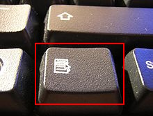
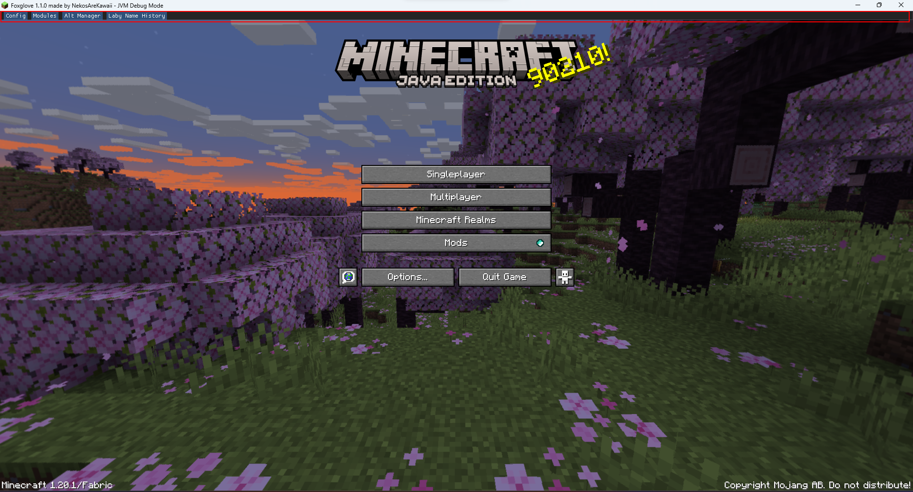

# Foxglove

Foxglove is a utility mod for Minecraft designed to work with the Fabric Mod Loader.

## Helpful Information

### How to Open the Main Bar

To open the main bar, use the menu key [≣] by default. The menu key is represented by the following icon:

The main bar itself looks like this:

